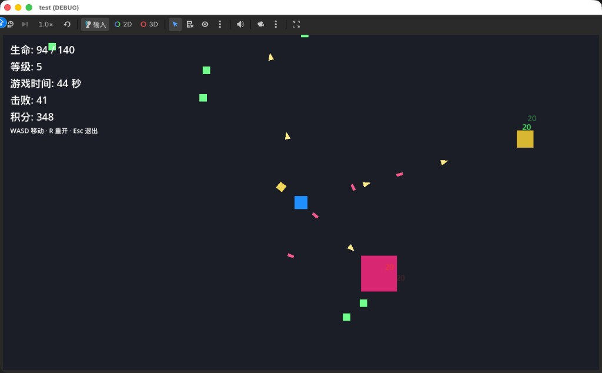

# 幸存者原型（Godot 4）

2D 类吸血鬼幸存者小玩法：移动、自动射击、刷怪、经验、定时强化三选一、Boss（弹幕与冲锋等）、精英远程弹、伤害飘字、**全局音效（Autoload `GameAudio`）** 等。

## 预览

## 文档入口

| 文档 | 内容 |
|------|------|
| [docs/DIRECTORY.md](docs/DIRECTORY.md) | **目录树**与文件夹约定 |
| [docs/GAMEPLAY.md](docs/GAMEPLAY.md) | **玩法流程、碰撞层、音频、Cursor 工作区、扩展点**（给人与 AI 阅读） |

## 运行

- 引擎：Godot **4.x**（与 `project.godot` 中 `config/features` 一致）
- 主场景：`res://scenes/main.tscn`（已在 `project.godot` 配置）

## 目录约定（摘要）

- `scenes/` — 按 `player`、`enemies`、`combat`、`pickups`、`fx` 分类；`main.tscn` 在根下。
- `scripts/` — 与 `scenes` 同结构；`scripts/core/main.gd` 为主逻辑，`game_audio.gd` 为全局音效；`scripts/data/` 放无场景的数据脚本。
- `audio/` — BGM/SFX 资源；占位文件可用 `tools/gen_placeholder_audio.py` 生成。

详细说明见 **docs/DIRECTORY.md**；玩法、碰撞层、音频与扩展点见 **docs/GAMEPLAY.md**。
